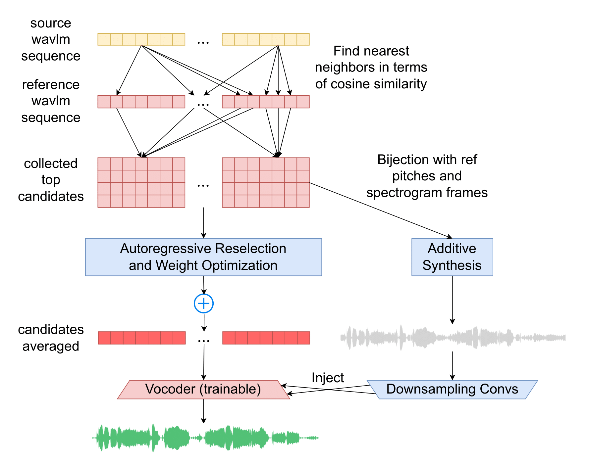

# kNN-SVC: Robust Zero-Shot Singing Voice Conversion with Additive Synthesis and Concatenation Smoothness Optimization (kNN-SVC)

(Some cleaning still ongoing, but you are welcome to submit issues or pull requests)

The official code repo! This repo contains training and inference code for the paper "kNN-SVC: Robust Zero-Shot Singing Voice Conversion with Additive Synthesis and Concatenation Smoothness Optimization". The trained checkpoints are available under the 'Releases' tab.

Links:

- Arxiv paper: [https://arxiv.org/abs/2504.05686](https://arxiv.org/abs/2504.05686)
- Demo page with samples: [http://knnsvc.com/](http://knnsvc.com/)




Figure: kNN-SVC setup. Two techniques that synergize with the knn-VC backbone to enhance the robustness of the singing voice conversion. 

The source and reference utterance(s) are encoded into self-supervised features using WavLM. Each source feature is assigned to the mean of the k closest features from the reference. The resulting feature sequence is then vocoded with HiFi-GAN to arrive at the converted waveform output.

**Authors**:

- [Keren Shao](https://scholar.google.com/citations?user=jcQHdRgAAAAJ)
- [Ke Chen](https://www.knutchen.com/)
- [Matthew Baas](https://rf5.github.io/)
- [Shlomo Dubnov](http://dub.ucsd.edu/)


*Equal contribution

## Quickstart

```bash
usage: ddsp_inference.py src_file tgt_file post_opt_0.2 mix_harm_no_amp_0.552
```

I will update a helper function to clarify the argument `post_opt_0.2` and `mix_harm_no_amp_0.552`. (Some hardcoded references may also need to be updated in the scripts, please submit a issue if you spot any.)

## Checkpoints

Under the releases tab of this repo we provide three checkpoints:

- The frozen WavLM encoder taken from the [original WavLM authors](https://github.com/microsoft/unilm/tree/master/wavlm), which we host here for convenience and torch hub integration.
- The HiFiGAN vocoder trained on **prematched** layer 6 of WavLM features (the best model in the paper).


## Training

We follow the typical encoder-converter-vocoder setup for voice conversion. The encoder is WavLM, the converter is k-nearest neighbors regression, and vocoder is HiFiGAN. The only component that requires training is the vocoder:

1. **WavLM encoder**: we simply use the pretrained WavLM-Large model and do not train it for any part of our work. We suggest checking out the original [WavLM repo](https://github.com/microsoft/unilm) to train your own SSL encoder.
2. **kNN conversion model**: kNN is non-parametric and does not require any training :)
3. **HiFiGAN vocoder**: we adapt the original [HiFiGAN author's repo](https://github.com/jik876/hifi-gan) for vocoding WavLM features. This is the only part which requires training.

### HiFiGAN training

For training we require the same dependencies as the original HiFiGAN training [here](https://github.com/jik876/hifi-gan/blob/master/requirements.txt) -- namely `librosa`, `tensorboard`, `matplotlib`, `fastprogress`, `scipy`.
Then, to train the HiFiGAN:

1. **Precompute WavLM features of the vocoder dataset**: we provide a utility for this for the LibriSpeech dataset in `prematch_dataset.py`:

    ```bash
    usage: prematch_dataset.py [-h] --librispeech_path LIBRISPEECH_PATH
                            [--seed SEED] --out_path OUT_PATH [--device DEVICE]
                            [--topk TOPK] [--matching_layer MATCHING_LAYER]
                            [--synthesis_layer SYNTHESIS_LAYER] [--prematch]
                            [--resume]
    ```

    where you can specify `--prematch` or not to determine whether to use prematching when generating features or not. For example, to generate the dataset used to train the prematched HiFiGAN from the paper:
    `python prematch_dataset.py --librispeech_path /path/to/librispeech/root --out_path /path/where/you/want/outputs/to/go --topk 4 --matching_layer 6 --synthesis_layer 6 --prematch`

2. **Train HiFiGAN**: we adapt the training script from the [original HiFiGAN repo](https://github.com/jik876/hifi-gan) to work for WavLM features in `hifigan/train.py`. To train a hifigan model on the features you produced above:

    ```bash
    python -m hifigan.train --audio_root_path /path/to/librispeech/root/ --feature_root_path /path/to/the/output/of/previous/step/ --input_training_file data_splits/wavlm-hifigan-train.csv --input_validation_file data_splits/wavlm-hifigan-valid.csv --checkpoint_path /path/where/you/want/to/save/checkpoint --fp16 False --config hifigan/config_v1_wavlm.json --stdout_interval 25 --training_epochs 1800 --fine_tuning
    ```

    That's it! Once it is run up till 2.5M updates (or it starts to sound worse) you can stop training and use the pretrained checkpoint.


## Repository structure

The codebase mostly maintains consistency with the knn-vc (https://github.com/bshall/knn-vc). The `ddsp_` prefix is just a relic rename, and the additive synthesis part does not involve the use of neural networks. The implementations for the techniques introduced in the paper can be found at `ddsp_prematch_dataset.py`. 


```
├── data_splits                             # csv train/validation splits for librispeech train-clean-100
│   ├── wavlm-hifigan-train.csv
│   └── wavlm-hifigan-valid.csv
├── hifigan                                 # adapted hifigan code to vocode wavlm features
│   ├── config_v1_wavlm.json                # hifigan config for use with wavlm features
│   ├── ddsp_meldataset.py                       # mel-spectrogram transform used during hifigan training
│   ├── models.py                           # hifigan model definition
│   ├── train.py                            # hifigan training script
│   └── utils.py                            # utilities used for hifigan inference/training
├── ddsp_hubconf.py                              # torchhub integration
├── ddsp_matcher.py                              # kNN matching logic and model wrapper
├── ddsp_prematch_dataset.py                     # script to precompute wavlm features for librispeech
├── README.md                               
└── wavlm                                   
    ├── modules.py                          # wavlm helper functions (from original WavLM repo)
    └── WavLM.py                            # wavlm modules (from original WavLM repo)
```


## Acknowledgements

Parts of code for this project are adapted from the following repositories -- please make sure to check them out! Thank you to the authors of:

- HiFiGAN: https://github.com/jik876/hifi-gan
- WavLM: https://github.com/microsoft/unilm/tree/master/wavlm


## Citation

```bibtex
@inproceedings{shao2025knn,
  title={kNN-SVC: Robust Zero-Shot Singing Voice Conversion with Additive Synthesis and Concatenation Smoothness Optimization},
  author={Shao, Keren and Chen, Ke and Baas, Matthew and Dubnov, Shlomo},
  booktitle={ICASSP 2025-2025 IEEE International Conference on Acoustics, Speech and Signal Processing (ICASSP)},
  pages={1--5},
  year={2025},
  organization={IEEE}
}
```


